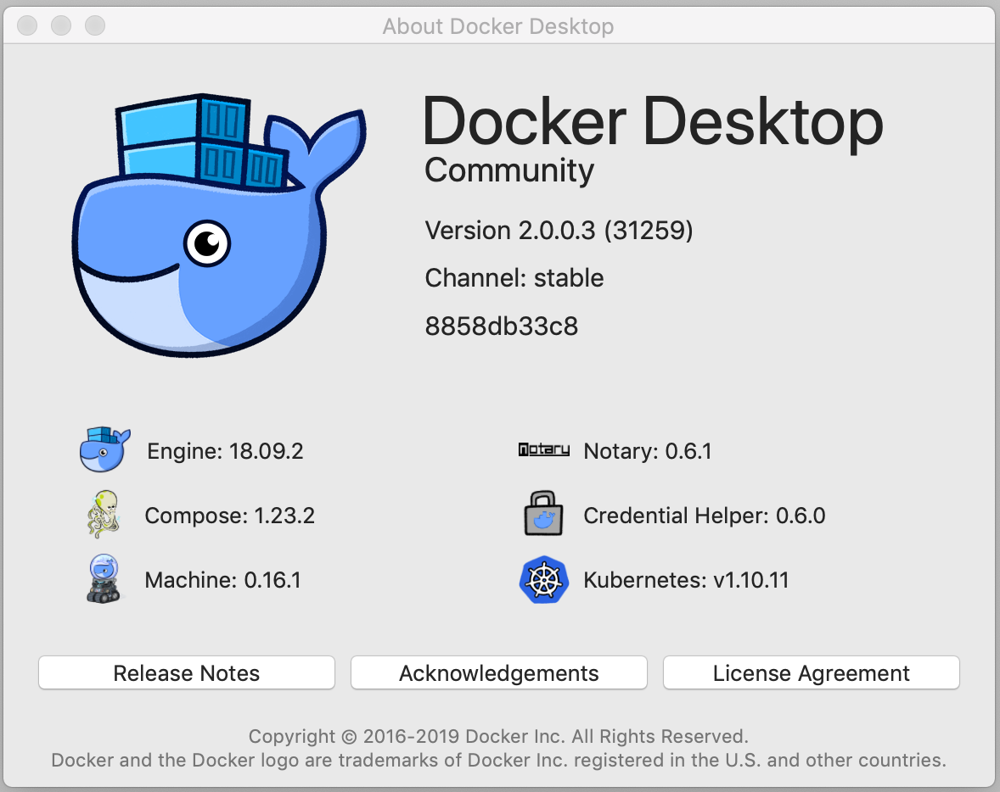

# spark-cassandra-zeppelin-docker
A docker setup for running Spark(2 nodes) Cassandra(2 nodes) and a Zeppelin server. This repository also contains a demo notebook to read json(jsonl) file from filesystem and push data to Cassandra key-space.

## Prerequisites
Ensure you have [Docker Desktop](https://www.docker.com/products/docker-desktop) installed. The definitions in this directory have been verified to work with the following setup.



## Starting Up The Containerized Environment
```
cd spark-cassandra-zeppelin-docker
docker-compose up
```

After starting up the environment, you can access the various web UIs listed below

### Zeppelin Server
After starting Zeppelin Server, navigate to http://localhost:8085 in a browser to access the Zeppelin UI. 

An example notebook ("Example Spark and SparkSQL Notebook") is included with the Zeppelin notebook server.

Additional examples can be found on GitHub at hortonworks-gallery/zeppelin-notebooks

### Testbed
|Name|Description|URL|
|---|---|---|
|Spark Master UI|Web UI for managing Spark jobs|http://localhost:3030|


## Useful Commands For Working With Docker Containers
|Description|Command|
|---|---|
|Start all containers defined in the `docker-compose.yml` of your current directory. Force the container image to be rebuilt.|`docker-compose up --build`|
|Stop all containers defined in the `docker-compose.yml` of your current directory.|`docker-compose down`|
|List all running containers.|`docker ps`|
|Display in CPU/Memory/I/O stats for all containers|`docker stats`|
|Stop/Start/Restart a specific container by Container ID or Container Name.|`docker stop <Container ID or Container Name>`<br>`docker stop <Container ID or Container Name>`<br>`docker restart <Container ID or Container Name>`|
|Build and start end to end full JanusGraph environment defined in the `docker-janusgraph-compose.yml`. Force the container images to be rebuilt.|`docker-compose -f docker-janusgraph-compose.yml up --build`|

Below are some functions that can be added to `~/.bash_profile` for quickly resetting your environment.


## Spark
To understand on how to submit jobs to the spark cluster please refer [here](https://spark.apache.org/docs/latest/submitting-applications.html) or explore the sample spark-submit build located at `spark\submit`

```$xslt
###########################
##### DOCKER COMMANDS #####
###########################

### Stop and wipe the containers defined in the current directory's docker-compose.yml file. ###
docker_compose_wipe() {
    docker-compose ps -q | xargs -I% docker-compose stop %
    docker-compose ps -aq | xargs -I% docker-compose rm %
    docker-compose volume prune
}

### Stop and wipe the containers defined in the current directory's docker-compose.yml file. Then start a fresh set of containers. ###
docker_compose_reset() {
    docker_compose_wipe
    docker-compose up --build
}

### Stop ALL containers, including those that aren't included in the current directory's docker-compose.yml file. ###
docker_stop_all() {
    docker ps -aq | xargs -I% docker stop %
}


### Stop and wipe ALL containers. ###
docker_wipe_all() {
    docker ps -q | xargs -I% docker stop %
    docker ps -aq | xargs -I% docker rm %
    docker volume prune
}


### Stop and wipe ALL containers. Remove all containers images and volumes as well. ###
docker_armageddon() {
    docker_wipe_all
    docker rmi -f $(docker images --filter dangling=true -qa)
    docker volume rm $(docker volume ls --filter dangling=true -q)
}
```

